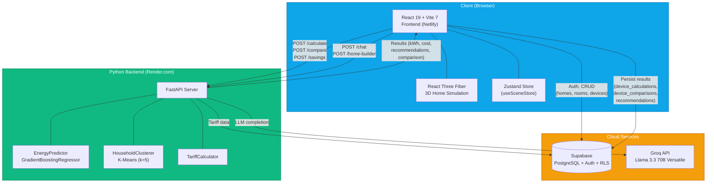
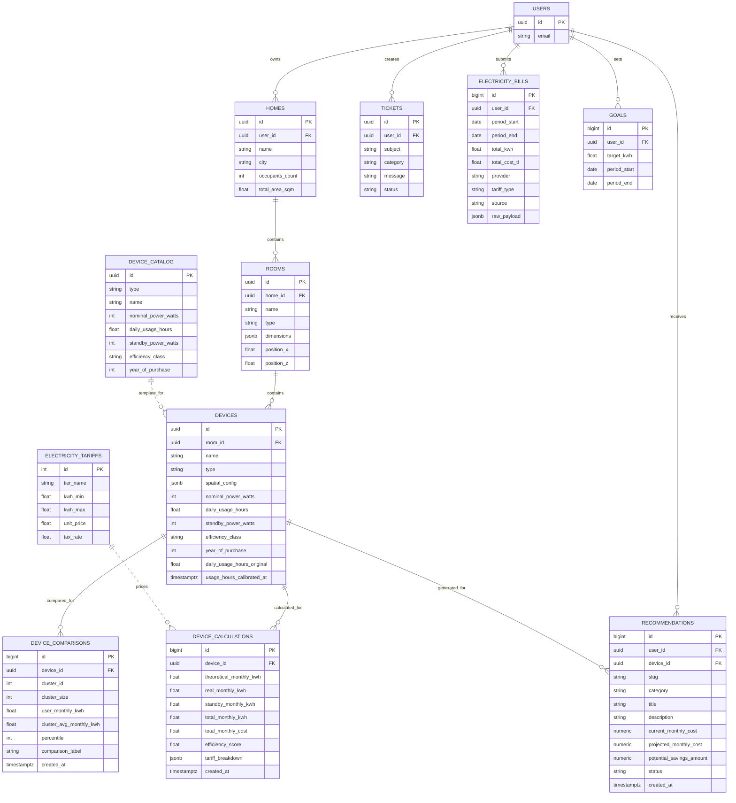
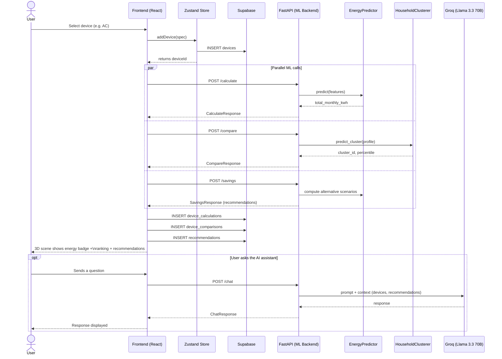

# KWhane — Şema / Diyagram Kodları (İngilizce)

Bu dosyadaki kodları ilgili sitelere yapıştırarak görselleri oluşturabilirsin (diyagramların içeriği İngilizce):

- **Mermaid diyagramları** (Architecture, ER, System Flow) → https://mermaid.live
- **Chart.js grafikleri** (Feature Importance, Silhouette Score, Peer Ranking Gauge) → https://quickchart.io/sandbox (kodu yapıştır, anında render eder)

---

## 1. Architecture Diagram

> mermaid.live içine yapıştır



---

## 2. ER Diagram

> mermaid.live içine yapıştır



---

## 3. Feature Importance Bar Chart

> Veri kaynağı: `ML-python/trained_models/energy_regressor_metadata.json`
> (GradientBoostingRegressor — `feature_importances_`)

### Chart.js (quickchart.io/sandbox)

```json
{
  "type": "bar",
  "data": {
    "labels": [
      "device_type",
      "nominal_power_watts",
      "daily_usage_hours",
      "efficiency_class",
      "device_age_years",
      "standby_power_watts"
    ],
    "datasets": [
      {
        "label": "Feature Importance",
        "data": [0.5669, 0.2211, 0.1555, 0.0458, 0.0103, 0.0004],
        "backgroundColor": [
          "#10b981",
          "#3b82f6",
          "#6366f1",
          "#f59e0b",
          "#ef4444",
          "#94a3b8"
        ]
      }
    ]
  },
  "options": {
    "indexAxis": "y",
    "plugins": {
      "title": {
        "display": true,
        "text": "GradientBoostingRegressor — Feature Importance (energy_regressor_v1)"
      },
      "legend": { "display": false }
    },
    "scales": {
      "x": {
        "title": { "display": true, "text": "Importance Score" },
        "max": 0.6
      }
    }
  }
}
```

**Not:** quickchart.io/sandbox sayfasına bu JSON'u yapıştır → anında PNG/SVG çıktısı alırsın. İndirme linki için aynı JSON'u şu URL'ye query param olarak da gönderebilirsin: `https://quickchart.io/chart?c=<json>`

---

## 4. Silhouette Score Chart

> Kaynak: `ML-python/ml/clustering_model.py` — `HouseholdClusterer.train()`
> K-Means, k=5 cluster, `silhouette_score()` ile hesaplanıyor.
> Farklı k değerleri için elbow/silhouette eğrisi istiyorsan aşağıdaki yapıyı kullan (gerçek değerleri `train()` çıktısından alıp güncelle).

### Chart.js — Silhouette Score vs. k

```json
{
  "type": "line",
  "data": {
    "labels": ["k=2", "k=3", "k=4", "k=5", "k=6", "k=7", "k=8"],
    "datasets": [
      {
        "label": "Silhouette Score",
        "data": [0.42, 0.48, 0.51, 0.55, 0.50, 0.46, 0.43],
        "borderColor": "#10b981",
        "backgroundColor": "rgba(16,185,129,0.15)",
        "fill": true,
        "tension": 0.3,
        "pointRadius": 6,
        "pointBackgroundColor": "#10b981"
      }
    ]
  },
  "options": {
    "plugins": {
      "title": {
        "display": true,
        "text": "K-Means Silhouette Score by Cluster Count (Selected: k=5)"
      }
    },
    "scales": {
      "y": {
        "title": { "display": true, "text": "Silhouette Score" },
        "min": 0,
        "max": 1
      },
      "x": {
        "title": { "display": true, "text": "Number of Clusters (k)" }
      }
    }
  }
}
```

> **Önemli:** Bu grafikteki sayılar örnek/placeholder. Gerçek silhouette skorunu almak için backend'de şu komutu çalıştır:
> ```
> python -c "from ml.clustering_model import HouseholdClusterer; c = HouseholdClusterer('trained_models'); print(c.train())"
> ```
> Çıktıdaki `silhouette_score` değerini k=5 noktasına yaz, diğer k değerleri için `n_clusters` parametresini değiştirip tekrar çalıştır.

---

## 5. System Flow (Add Device → Analysis Flow)

> mermaid.live içine yapıştır



---

## 6. Peer Ranking Gauge

> Kullanıcının `/compare` veya `/compare/home` sonucundaki `percentile` değerini gösteren gauge.
> Chart.js'de native gauge yok, bu yüzden `doughnut` (yarım halka) ile simüle ediyoruz.

### Chart.js — Half-Doughnut Gauge (örnek: percentile = 35, yani kullanıcı eşdeğer evlerin %35'inden daha az tüketiyor → iyi)

```json
{
  "type": "doughnut",
  "data": {
    "labels": ["Your Consumption (Percentile)", "Remaining"],
    "datasets": [
      {
        "data": [35, 65],
        "backgroundColor": ["#10b981", "#1e293b"],
        "borderWidth": 0,
        "circumference": 180,
        "rotation": 270
      }
    ]
  },
  "options": {
    "plugins": {
      "title": {
        "display": true,
        "text": "Your Ranking vs. Similar Homes: 35th Percentile (Low Consumption — Good!)"
      },
      "legend": { "display": false },
      "tooltip": { "enabled": false }
    },
    "cutout": "75%"
  }
}
```

**Renk eşiği önerisi (HomeRanking.jsx mantığına paralel):**
- `percentile <= 33` → yeşil `#10b981` ("Low consumption — good")
- `34 <= percentile <= 66` → sarı `#f59e0b` ("Average")
- `percentile >= 67` → kırmızı `#ef4444` ("High consumption — attention needed")

İstersen `data.datasets[0].backgroundColor[0]` değerini gerçek `percentile` ve renk eşiğine göre dinamik doldurabilirsin.

---

## Kullanım İpuçları

1. **mermaid.live**: Sol panele kodu yapıştır → sağda canlı önizleme. "Actions" menüsünden PNG/SVG/PDF indirebilirsin.
2. **quickchart.io/sandbox**: JSON config'i yapıştır → "Update Chart" → sağ üstten indir.
3. Sunum dosyana (PowerPoint/Canva) bu görselleri PNG olarak aktarabilirsin.
4. ER diyagramındaki tablo/kolon isimleri `supabase/migrations/*.sql` dosyalarından alınmıştır — gerçek DB ile birebir eşleşir.
5. Feature importance değerleri `ML-python/trained_models/energy_regressor_metadata.json` dosyasından alınmıştır (model versiyonu: `energy_regressor_2026-06-06T12:52:12Z`, R²=0.989, MAE=7.23 kWh).
